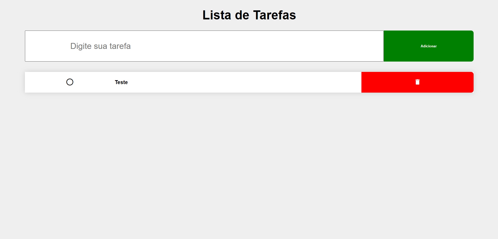
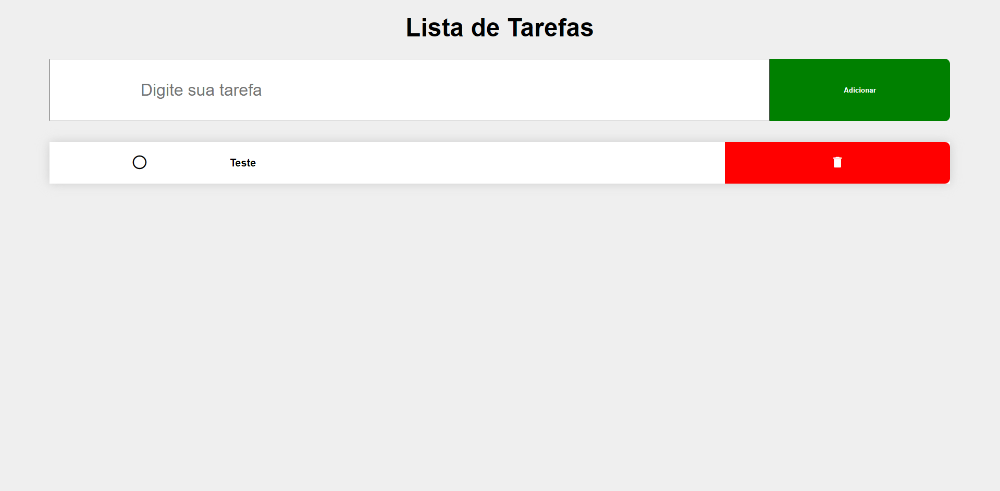
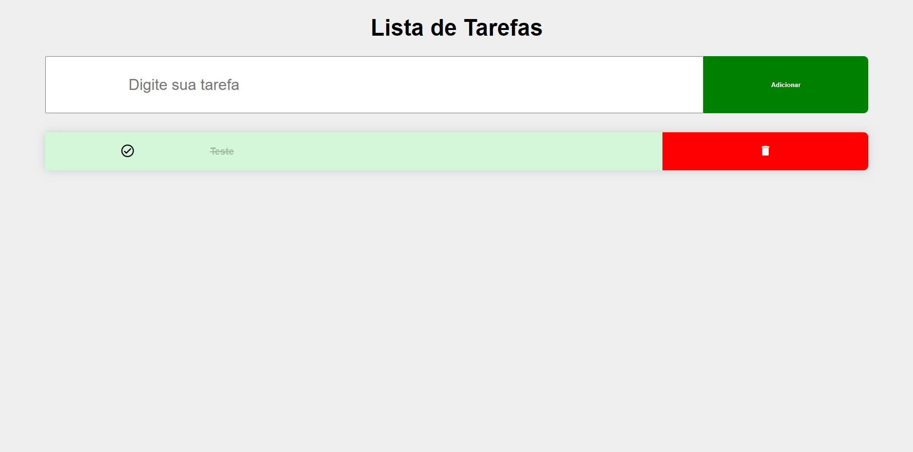
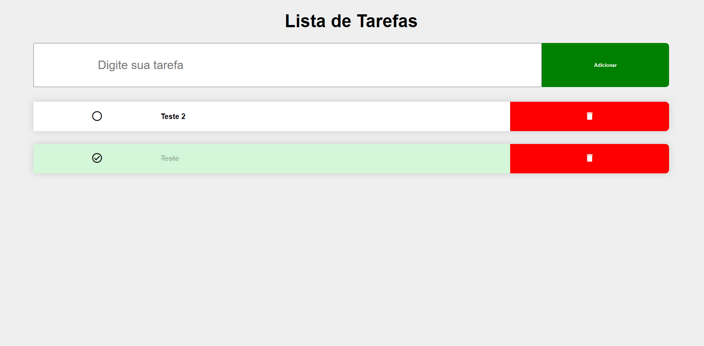

# Lista de Tarefas
Projeto pessoal desenvolvido apenas para praticar. 
O nome é autoexplicativo...

### Como inicar o projeto: 

- Basta baixar o código em formato zip.
- Descompactar em uma pasta de sua preferência
- Abrir a pasta no seu vscode ou outro
- Rodar o arquivo com live server.

## Tecnologias e Dependências

| Name | Link |
| ------ | ------ |
| HTML5 | [https://www.w3schools.com/html/] |
| CSS | [https://www.w3schools.com/css/] |
| JAVASCRIPT | [https://www.javascript.com/] |
| MDI | [https://pictogrammers.com/library/mdi/] |
